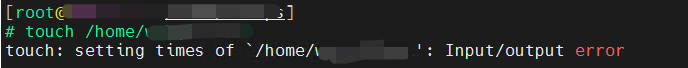

最近在排查一些异常服务器，由于我们无法直接接触BMC和机房，过程中就使用了各个厂商的raid管理工具做排查。

<!-- more -->

## 准备工作

首先，服务器可能会使用不同的RAID控制器，具体需要使用什么样的RAID管理工具就取决于控制器的型号，因此需要从操作系统中先看看，确认了RAID控制器后，使用对应的管理工具。

登录对应的Linux服务器，执行：

```bash
cat /proc/scsi/scsi
```

会有类似下面的输出，从中判断出RAID控制器的具体型号，比如我这里就是ASR7805：

```bash
Attached devices:
Host: scsi0 Channel: 00 Id: 00 Lun: 00
  Vendor: ASR7805  Model: RAID1            Rev: V1.0
  Type:   Direct-Access                    ANSI  SCSI revision: 02
Host: scsi0 Channel: 00 Id: 01 Lun: 00
  Vendor: ASR7805  Model: LogicalDrv 1     Rev: V1.0
  Type:   Direct-Access                    ANSI  SCSI revision: 02
Host: scsi0 Channel: 00 Id: 02 Lun: 00
  Vendor: ASR7805  Model: 02               Rev: V1.0
  Type:   Direct-Access                    ANSI  SCSI revision: 02
Host: scsi0 Channel: 01 Id: 08 Lun: 00
  Vendor: ATA      Model: HGST HUS724040AL Rev: MFAO
  Type:   Direct-Access                    ANSI  SCSI revision: 06
Host: scsi0 Channel: 01 Id: 09 Lun: 00
  Vendor: ATA      Model: HGST HUS724040AL Rev: MFAO
  Type:   Direct-Access                    ANSI  SCSI revision: 06
Host: scsi0 Channel: 01 Id: 10 Lun: 00
  Vendor: ATA      Model: HGST HUS724040AL Rev: MFAO
  Type:   Direct-Access                    ANSI  SCSI revision: 06
```
上述这个结果就是使用的PMC阵列卡，那么就要用官方的工具arcconf来进行管理，如果是下面的返回结果：

```bash
Attached devices:
Host: scsi0 Channel: 01 Id: 06 Lun: 00
  Vendor: LSI      Model: VirtualSES       Rev: 03
  Type:   Enclosure                        ANSI  SCSI revision: 07
Host: scsi0 Channel: 02 Id: 00 Lun: 00
  Vendor: AVAGO    Model: MR9460-8i        Rev: 5.13
  Type:   Direct-Access                    ANSI  SCSI revision: 05
Host: scsi16 Channel: 00 Id: 65 Lun: 00
  Vendor: LSI      Model: Cub              Rev: 0d00
  Type:   Enclosure                        ANSI  SCSI revision: 05
Host: scsi16 Channel: 02 Id: 00 Lun: 00
  Vendor: AVAGO    Model: MR9460-8i        Rev: 5.13
  Type:   Direct-Access                    ANSI  SCSI revision: 05
Host: scsi16 Channel: 02 Id: 01 Lun: 00
  Vendor: AVAGO    Model: MR9460-8i        Rev: 5.13
  Type:   Direct-Access                    ANSI  SCSI revision: 05
Host: scsi16 Channel: 02 Id: 02 Lun: 00
  Vendor: AVAGO    Model: MR9460-8i        Rev: 5.13
  Type:   Direct-Access                    ANSI  SCSI revision: 05
```

这里可以看到MR9460-8i这个设备型号，对应的就是MegaRAID 9460 8i，需要使用storcli工具进行管理，其他的型号我暂时没遇到，总之根据scsi返回的信息明确最终使用什么raid工具来操作

## Arcconf

Arcconf是Adaptec RAID控制器的官方维护工具，在Linux命令行中可以看到RAID的一些信息，通过下面的命令可以获取全部的raid控制器清单：

```bash
# arcconf list

Controllers found: 1
----------------------------------------------------------------------
Controller information
----------------------------------------------------------------------
   Controller ID             : Status, Slot, Mode, Name, SerialNumber, WWN
----------------------------------------------------------------------
   Controller 1:             : Optimal, Slot 14, RAID (Expose RAW), Adaptec ASR7805, 5C1113B82B7, 50000D1109811600

Command completed successfully.
```

这里我们有1个控制器，然后可以通过getconfig命令获取指定控制器的信息，比如获取该控制器的信息：

```bash
# arcconf getconfig 1 AD

Controllers found: 1
----------------------------------------------------------------------
Controller information
----------------------------------------------------------------------
   Controller Status                        : Optimal
   Controller Mode                          : RAID (Expose RAW)
   Channel description                      : SAS/SATA
   Controller Model                         : Adaptec ASR7805
   Controller Serial Number                 : 5C1113B82B7
   Controller World Wide Name               : 50000D1109811600
   Controller Alarm                         : Enabled
   Physical Slot                            : 14
   Temperature                              : 73 C/ 163 F (Normal)
   Installed memory                         : 1024 MB
   Host bus type                            : PCIe
   Host bus speed                           : 8000 MHz
   Host bus link width                      : 8 bit(s)/link(s)
   Global task priority                     : High
   Performance Mode                         : Default/Dynamic
   PCI Device ID                            : 652
   Stayawake period                         : Disabled
   Spinup limit internal drives             : 0
   Spinup limit external drives             : 0
   Defunct disk drive count                 : 0
   NCQ status                               : Enabled
   Statistics data collection mode          : Disabled
   Monitor Log Severity Level               : Informational
   --------------------------------------------------------
   Cache Properties
   --------------------------------------------------------
   Controller Cache Preservation            : Disabled
   Global Physical Device Write Cache Policy: Drive Specific
   --------------------------------------------------------
   RAID Properties
   --------------------------------------------------------
   Logical devices/Failed/Degraded          : 3/0/0
   Copyback                                 : Disabled
   Automatic Failover                       : Enabled
   Background consistency check             : Disabled
   Background consistency check period      : 0
   --------------------------------------------------------
   Controller BIOS Setting Information
   --------------------------------------------------------
   Runtime BIOS                             : Enabled
   Array BBS Support                        : Enabled
   Physical Drives Displayed during POST    : Disabled
   Backplane Mode                           : IBPI
   BIOS Halt on Missing Drive Count         : 255
   --------------------------------------------------------
   Controller Version Information
   --------------------------------------------------------
   BIOS                                     : 7.5-0 (32114)
   Firmware                                 : 7.5-0 (32114)
   Driver                                   : 1.2-0 (30300)
   Boot Flash                               : 7.5-0 (32114)
   CPLD (Load version/ Flash version)       : 8/ 10
   SEEPROM (Load version/ Flash version)    : 1/ 1

   --------------------------------------------------------
   Controller Cache Backup Unit Information
   --------------------------------------------------------

    Overall Backup Unit Status              : Ready

         Backup Unit Type                   : AFM-700/700LP
         Non-Volatile Storage Status        : Ready
         Supercap Status                    : Ready

         -----------------------------------
         Supercap Information
         -----------------------------------
         Current Temperature                : 29 deg C
         Threshold Temperature              : 51 deg C
         Life-time Temperature Recorded
         (Min/Max)                          : 19 deg C/ 46 deg C

         Voltage(Present/Max)               : 4948 mV/ 5302 mV
         Life-time Max Voltage Recorded     : 5484 mV

         Current Drawn(Present/Max)         : 0 mA/ 560 mA
         Health                             : 94 percent
         Charge Level                       : 100 percent
         Estimated Life-time                : 5 Years, 0 Month
         Serial Number                      : 6A066D40067
   --------------------------------------------------------
```

相比较之下，对`Logical device`信息做检查的操作要更多一些，这里看一个出现问题的节点，使用下面的命令：

```bash
# arcconf getconfig 1 ld

Controllers found: 1
----------------------------------------------------------------------
Logical device information
----------------------------------------------------------------------
Logical device number 0
   Logical device name                      : RAID1
   Block Size of member drives              : 512 Bytes
   RAID level                               : 1
   Status of logical device                 : Optimal
   Size                                     : 457718 MB
   Parity space                             : 457728 MB
   Read-cache setting                       : Disabled
   Read-cache status                        : Off
   Write-cache setting                      : Disabled
   Write-cache status                       : Off
   Partitioned                              : Yes
   Protected by Hot-Spare                   : No
   Bootable                                 : Yes
   Failed stripes                           : No
   Power settings                           : Disabled
   --------------------------------------------------------
   Logical device segment information
   --------------------------------------------------------
   Segment 0                                : Present (Controller:1,Enclosure:0,Slot:30) PHWL545600XY480QGN
   Segment 1                                : Present (Controller:1,Enclosure:0,Slot:31) PHWL545600FL480QGN

Logical device number 1
   Logical device name                      : 1
   Block Size of member drives              : 512 Bytes
   RAID level                               : 5
   Status of logical device                 : Failed
   Size                                     : 41958400 MB
   Parity space                             : 3814400 MB
   Stripe-unit size                         : 256 KB
   Read-cache setting                       : Enabled
   Read-cache status                        : On
   Write-cache setting                      : Enabled
   Write-cache status                       : Off
   Partitioned                              : Yes
   Protected by Hot-Spare                   : No
   Bootable                                 : No
   Failed stripes                           : No
   Power settings                           : Disabled
   --------------------------------------------------------
   Logical device segment information
   --------------------------------------------------------
   Segment 0                                : Present (Controller:1,Enclosure:0,Slot:0)      WD-WMC130FA19LA
   Segment 1                                : Missing
   Segment 2                                : Present (Controller:1,Enclosure:0,Slot:2)      WD-WMC130F7VC4J
   Segment 3                                : Present (Controller:1,Enclosure:0,Slot:3)      WD-WMC130F52SFV
   Segment 4                                : Present (Controller:1,Enclosure:0,Slot:4) N8GKS85Y
   Segment 5                                : Present (Controller:1,Enclosure:0,Slot:5)      WD-WMC130F8YM1F
   Segment 6                                : Present (Controller:1,Enclosure:0,Slot:6)      WD-WMC130F37FAC
   Segment 7                                : Present (Controller:1,Enclosure:0,Slot:7)      WD-WMC130F44A96
   Segment 8                                : Present (Controller:1,Enclosure:0,Slot:8)      WD-WMC130F40JAX
   Segment 9                                : Present (Controller:1,Enclosure:0,Slot:9)      WD-WMC130F9ZX40
   Segment 10                               : Present (Controller:1,Enclosure:0,Slot:10)      WD-WMC130F4HYZM
   Segment 11                               : Missing


Command completed successfully.

```
可以看到Segment 1和Segment 11的磁盘已经Missing了，在服务器上也验证这个raid盘出现了IO异常报错：

